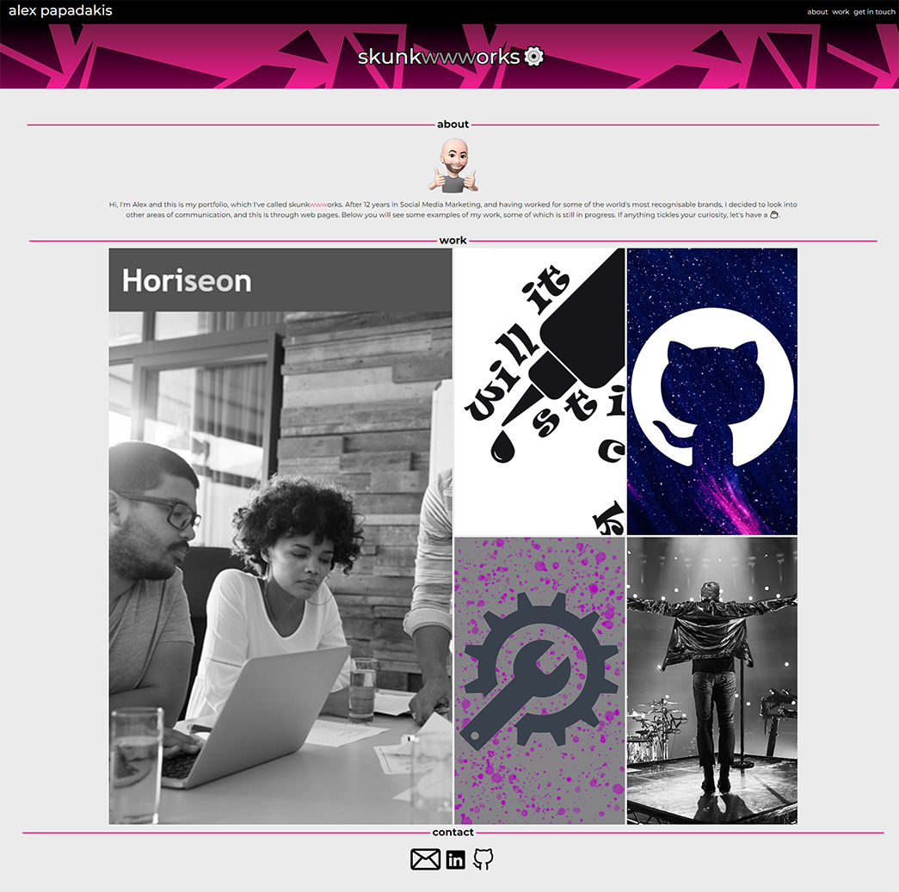
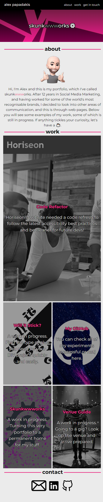

# Alex's Portfolio: Skunkwwworks

## Description 

This is a first iteration of my personal portfolio, with mostly concept projects for the time being. As time passes and I gain more experiences and builds that I can show, they will be uploaded to it, and it will also be transforming with new technologies and capabilities. At the moment, it is created solely with HTML, CSS, and ❤️.

## Application

The application can be found live on [GitHub Pages](https://lxpap.github.io/Portfolio_AP).

## Usage 

The application features a quick menu in the top right, a gallery of projects with their relevant links embedded in the middle, as well as a contact section that you can use to get in touch with me down at the bottom.

## Credits

For the creation of this personal use website, visual assets have been sourced from the following sources and edited to adapt:

* [Speech Bubble (edited) - Tom Kuhlmann](https://community.articulate.com/download/10-hand-drawn-square-speech-bubbles)
* [Hero Banner (edited) - mungfali.com](https://gr.pinterest.com/pin/475270566934872457/)
* [Pink Header Gradient - Miguel Nunez](https://medium.com/@miguelznunez/how-to-easily-add-an-image-overlay-to-your-images-with-css-e354a79f530d)
* [Glue Bottle Vector (edited) - Adobe Stock](https://stock.adobe.com/search?k=glue+bottle&asset_id=384599290)
* [Starry GitHub Logo (cropped) - TechWar.gr](https://en.techwar.gr/48308/ekatommyria-repos-tou-github-pithanotata-einai-evalota-sto-repojacking-lene-oi-erevnites/)
* [Wrench & Gear icon (edited) - vexels.com](https://www.vexels.com/png-svg/preview/157675/wrench-and-gear-icon?tap_s=576618-2da5a0)
* [Performer Photo (cropped) - invictamagazine.com](https://invictamagazine.com/live-architects-the-royal-albert-hall-21-11-2020/)
* [Email icon - Asyifa Wildiani](https://thenounproject.com/icon/email-6168165/)
* [LinkedIn icon - picons.me(iconfinder.com)](https://www.iconfinder.com/icons/104493/linkedin_icon)
* [GitHub icon - Guillaume Beaulieu](https://thenounproject.com/icon/github-4289652/)

Also, a big thank you to the AskBCS Learning Assistants that have helped me with various CSS tweaks, like using vw.

Other sources used for learning:
* [MDN](https://developer.mozilla.org/en-US/)
* [StackOverflow](https://stackoverflow.com/)
* [Claude.ai](https://claude.ai/)

## License

You can find a copy of the MIT license for this application in the repo.